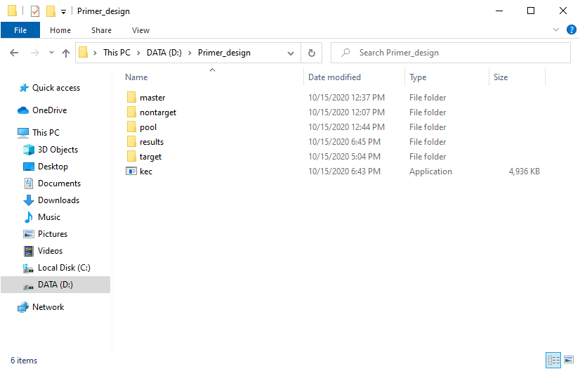
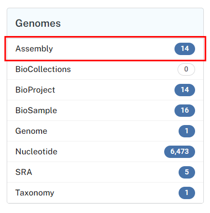
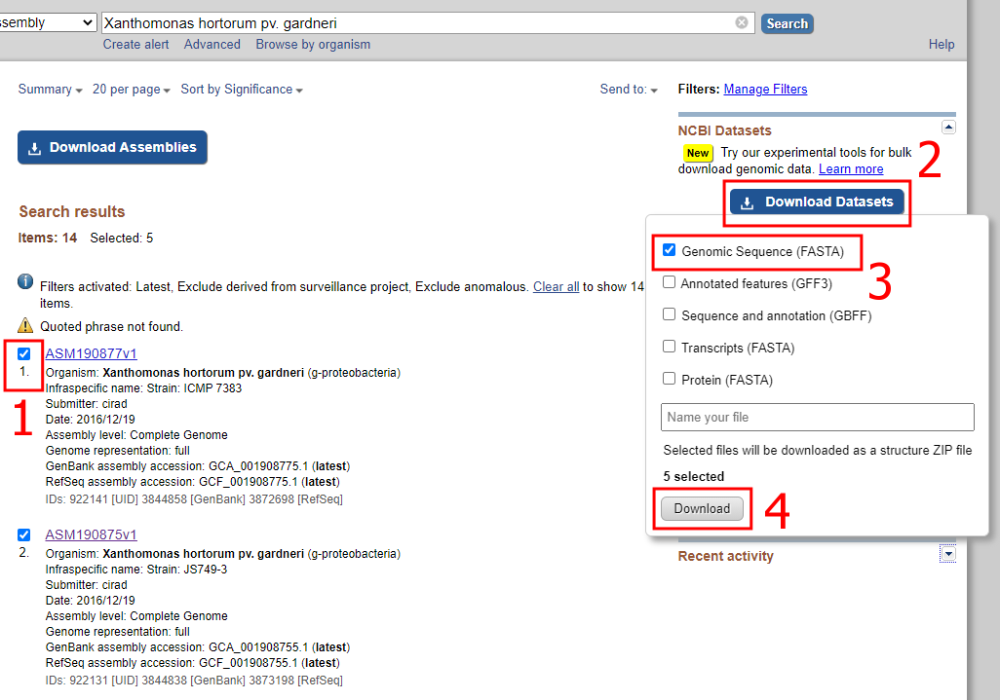
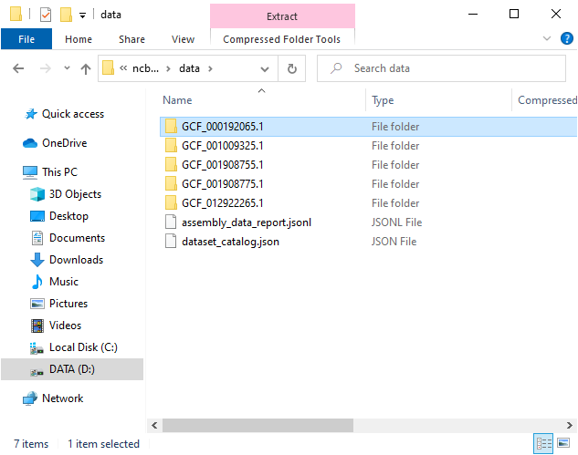
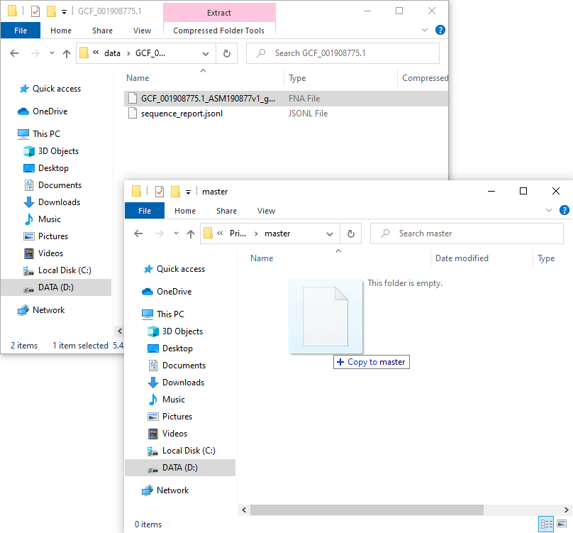

# KEC Tutorial

This tutorial is to show how KEC can be easily used for finding unique sequences suitable for the design of (PCR) primers for detection of specific bacteria by providing target and non-target genomes from online sources. In this case, sequences will be found for *Xanthomonas hortorum* pv. *gardneri* (target bacterial phytopathogen), NCBI database will be used as the source for genomic data, and all operations will be done in the Windows operating system. 

This tutorial provides only one of the many use cases of the KEC software, which can be adapted to any specific need of identifying unique sequences. Furthermore, this tutorial aims to show how to use the software from a technical point of view without consideration of the biological aspect.

1. First, create a directory structure in your computer. It is not strictly necessary to use this structure, but we will use it for clarity. The base directory, where all files will be downloaded and analyzed, will be   `D:\Primer_design`. On your computer, you can use any other directory on any drive but remember to replace it to match your directory structure.
    1. Create a new directory on drive `D:` named `Primer_design`
    2. In `D:\Primer_design` create the following directories:
        - `master`
        - `pool`
        - `target`
        - `nontarget`
        - `results`

2. Download KEC from <https://github.com/berybox/KEC/releases>. The program is a standalone executable and does not require installation. It can be placed in any directory on the computer. For simplicity, in this tutorial, the program will be placed in our base directory `D:\Primer_design`. The directory structure should now look similar to this:

 

> NOTE: During the download or after the first launch of the program, you can get antivirus warnings stating that the program may be harmful. However, if downloaded from the mentioned official website, the program only works as stated, without any malicious activity or data collection. Users may inspect and compile from source code, available at <https://github.com/berybox/KEC>, if security is a concern.

3. Download genomic data from the NCBI (or any other) database. KEC currently only reads `FASTA` formatted files.
    * In your web browser, go to <https://www.ncbi.nlm.nih.gov>
    * Put *Xanthomonas hortorum* pv. *gardneri* to the search box and click `Search` 
    
    

    * On the next page click `Assembly`
    
    
    
    * Click the checkboxes of all assemblies you want to use as a target for your primer design (1). In this tutorial, we will use assembly numbers 1 to 5. Then click `Download Datasets` (2) on the right
    * In the popup window, make sure that only `Genomic Sequence (FASTA)` checkbox is checked (3) and click `Download` (4) 
    
    
    
    * A zip file of the dataset will be downloaded to your computer
    * Clicking the downloaded zip file should open it in File Explorer. Then navigate to `ncbi_dataset` and `data`. You should see five directories, each containing a `FASTA` (`.fna` extension in this case) file with one of the assemblies 
    
    
    
    * Navigate to the directory with a file that will be used as a master sequence (in this case `GCF_001908775.1` and copy the `FNA` file to the directory `master` in the base directory (i.e. `D:\Primer_design\master`) 
    
    
    
    * Copy the other four assemblies to the `D:\Primer_design\pool` in the same way, so the directory `pool` will contain four `FNA` files 
    
    
    